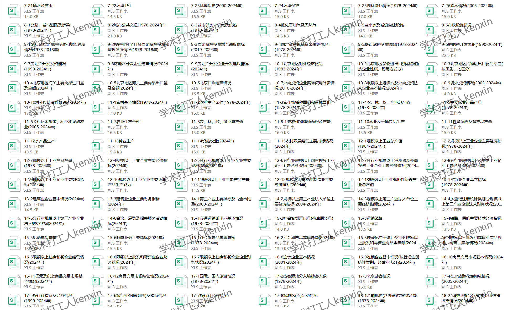
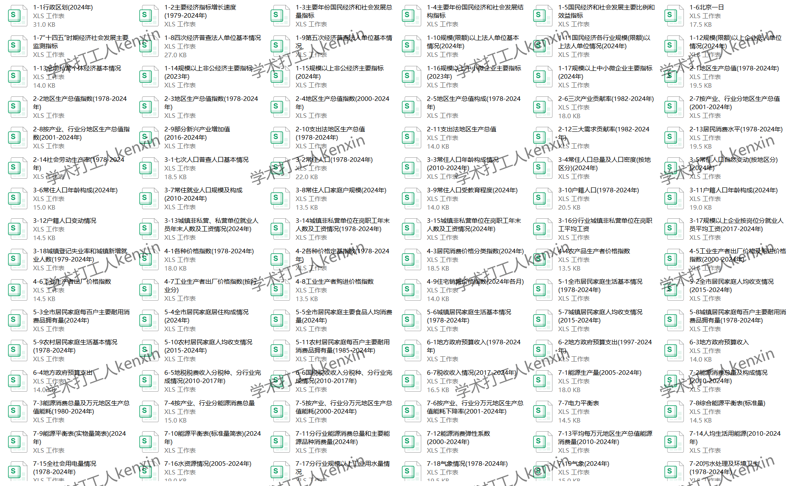
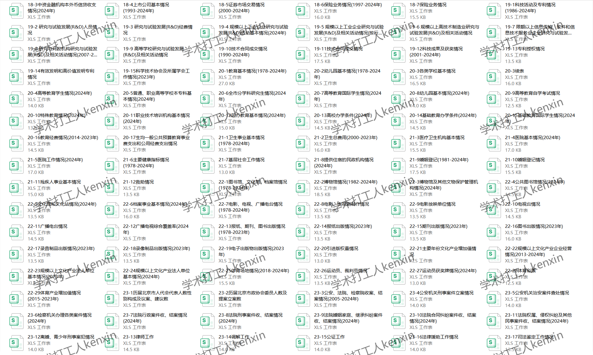
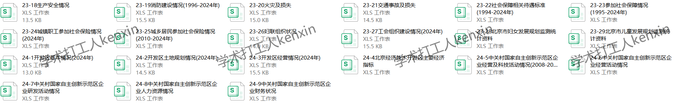

## Body

《Beijing Statistical Yearbook》（1980-2025）

Data Year: The title year is the year the data was compiled, so the data year needs to be one less than the title year.
See the image below for a complete display of the description, please confirm before purchasing! After shipping, any reason not to return or exchange is not accepted!

01. Data Introduction
The Beijing Statistical Yearbook

02. Index Details
(1) The directory is displayed in the image, please take your time to view it and make an informed purchase. If you need help finding specific indicators, all information is here. After shipping, there are no returns or exchanges without a reason.
(2) The display directory is for the year 2023, due to space limitations, only part of it is shown. The statistical methods may change from year to year, academic common sense, the data year recorded in statistical materials is the previous year's data as well as academic common sense, please note.
(3) The EXCEL format data is organized from original materials, including the content of the original material data but not the text content.
(4) If the data is placed in a zip file, you need to save the zip file first, then download, then extract.
(5) If there is Excel protection, you can select all by copying to a new sheet to use.

03. Data Format
PDF for 1980-2023, Excel for 2024 and 2025

## Images

Here is a pay link on Stripe ( https://buy.stripe.com/3cs8yP7sY87d0vu9AB ). Please contact me lonlonago@foxmail.com after funding $89, and I will send you a complete data files , thank you!

